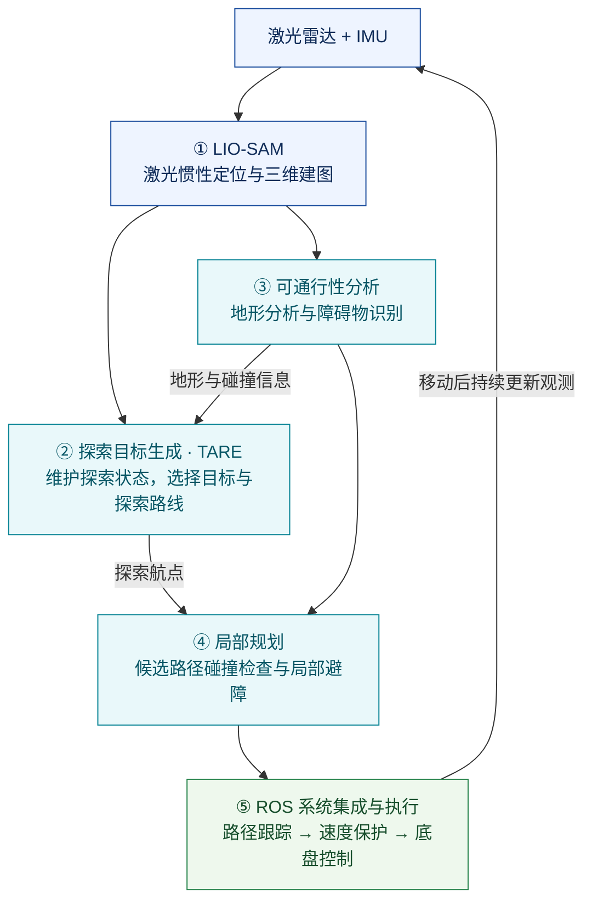
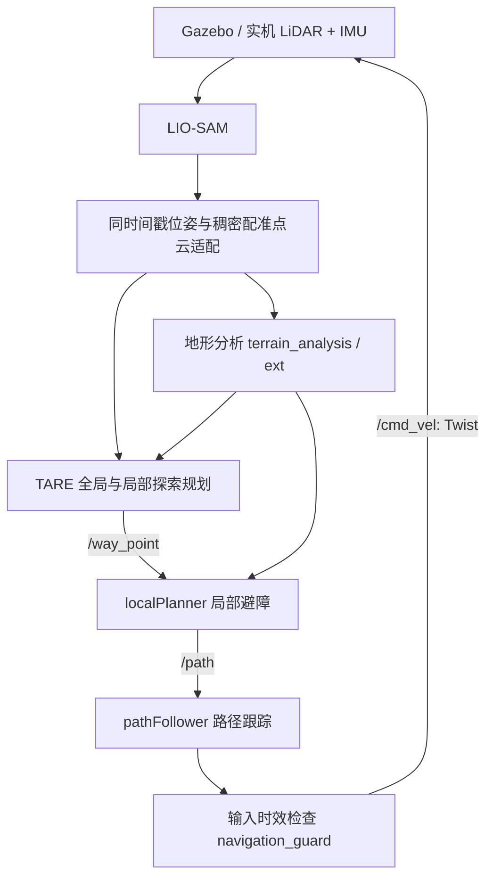

# ALPS-SLAM

基于 **LIO-SAM + CMU TARE + 局部避障与路径跟踪** 的移动机器人自主探索项目。
目标是在未知环境中边定位建图、边选择探索区域、边避障行驶，并在探索结束后返航。

当前版本提供 ROS 1 集成代码、仓库仿真启动入口与离线检查。
**尚未通过 ROS/Gazebo 端到端验收，不能把这些接线修改视为已验证的自主导航效果。**
离线验证范围及仿真验收步骤见 [docs/VALIDATION.md](docs/VALIDATION.md)。

## 系统组成

### 技术路线：自主探索

对应项目展示图左侧的“路线① 自主探索”，以 LIO-SAM 提供定位与地图、
TARE 选择探索目标，并通过地形分析、局部避障和底盘控制形成探索闭环。
下图是技术路线示意，不代表已经完成仿真验收。



可通行性分析同时服务 TARE 与局部规划，因此图中保留这两条数据连接。
ROS 集成贯穿所有模块，第⑤步突出的是将规划结果交给路径跟踪和底盘执行。
参考图右侧的 FAR + FAST-LIO 目标点导航属于另一条路线，当前仓库未集成。

### 模块连接



- `LIO-SAM`：激光与惯性融合的位姿估计、三维建图。
- `terrain_analysis`、`terrain_analysis_ext`：从世界坐标系点云生成地形信息，供碰撞检查使用。
- `third_party/tare_planner`：上游 TARE 的探索规划器，使用 `dependencies.repos` 固定版本下载。
- `local_planner`：CMU 局部候选路径碰撞检查和路径跟踪。
- `alps_bringup`：接口适配、统一启动、初始参数、RViz 和速度保护。
- `my_simulation`、`aws-robomaker-small-warehouse-world`：差速车、传感器和仓库场景。

TARE 是选择探索区域和路线的规划器；AEDE 是其配套的自主探索开发环境。
本项目集成已有的 CMU 地形分析与局部规划模块，采用自己的 Gazebo 仓库仿真。
RViz 手动目标模式只提供局部目标跟踪，**尚未实现已知地图上的全局目标导航、move_base action 或重定位**。

## 环境与依赖

目标环境：Ubuntu 20.04、ROS Noetic、Gazebo Classic 11、Python 3，优先使用 x86_64。
TARE 固定于 `melodic-noetic` 分支提交 `44500592b86138257273e0cab264e6a847ccefc7`。
其仓库携带 OR-Tools 库；ARM 平台需按上游说明替换对应架构的库。

在已经安装 ROS Noetic 的机器上：

```bash
source /opt/ros/noetic/setup.bash
sudo apt update
sudo apt install python3-vcstool python3-rosdep \
  ros-noetic-gazebo-ros-pkgs ros-noetic-velodyne-gazebo-plugins \
  ros-noetic-xacro ros-noetic-robot-state-publisher ros-noetic-rviz \
  ros-noetic-pcl-ros ros-noetic-cv-bridge ros-noetic-tf2-sensor-msgs \
  libgoogle-glog-dev libboost-timer-dev
```

另按 [LIO-SAM 的依赖说明](LIO-SAM/README.md#dependency) 安装 GTSAM 4.0 系列，
需要同时提供 `gtsam` 与 `gtsam_unstable`，并保证 CMake 可以找到 `GTSAMConfig.cmake`。
GTSAM 不由本项目的 `rosdep` 步骤自动安装。

```bash
mkdir -p ~/alps_ws/src
git clone https://github.com/CuiLikun/ALPS-SLAM.git ~/alps_ws/src/ALPS-SLAM
cd ~/alps_ws/src/ALPS-SLAM
mkdir -p third_party
vcs import third_party < dependencies.repos

cd ~/alps_ws
# rosdep 尚未初始化时先执行 sudo rosdep init（只需要一次）
rosdep update
rosdep install --from-paths src --ignore-src --rosdistro noetic --skip-keys GTSAM -y
catkin_make -DCMAKE_BUILD_TYPE=Release
source devel/setup.bash
```

以上 GitHub 克隆命令适用于修改提交到远端以后；使用尚未推送的本地版本时，
请将本目录完整放到 `~/alps_ws/src/ALPS-SLAM`，再导入依赖与编译。
不要再往同一工作空间添加第二份 AEDE 的同名 `local_planner` / `terrain_analysis` 包。
当前支持 catkin **devel workspace** 运行；尚未验收整套依赖的 install-space 部署。

## 运行

### 仓库自主探索

```bash
source ~/alps_ws/devel/setup.bash
roslaunch alps_bringup simulation.launch
```

默认启动 Gazebo、LIO-SAM、地形分析、TARE、路径跟踪与 RViz，速度上限初值为 0.3 m/s。
TARE 默认等待启动信号。确认 `/registered_scan`、`/state_estimation_at_scan`、`/terrain_map`
都有数据，RViz 点云位置正常后，在另一个已 source 的终端执行：

```bash
rostopic pub -1 /start_exploration std_msgs/Bool 'data: true'
```

自动开始或无界面启动：

```bash
roslaunch alps_bringup simulation.launch auto_start:=true
roslaunch alps_bringup simulation.launch gui:=false rviz:=false
```

TARE 的 `/start_exploration=false` **不是暂停命令**，上游仅处理 true。
`exploration_finish=true` 表示完成覆盖、开始返航，因此速度保护不会因此截断返航。
需要停车时，可对路径跟踪器发送：

```bash
rostopic pub -1 /stop std_msgs/Int8 'data: 2'
# 允许恢复路径跟踪：
rostopic pub -1 /stop std_msgs/Int8 'data: 0'
```

这控制的是当前软件路径跟踪器，实机仍需底盘自身的通信超时停车机制。

### RViz 手动局部目标

```bash
roslaunch alps_bringup simulation.launch exploration:=false
```

用 RViz 的 `2D Nav Goal` 发目标，适配器通过 TF 转换到 `map`。
这一模式不启动 TARE，避免两个节点同时发布 `/way_point`。
手动目标不会因长时间没有重复发布而过期，但定位、点云、路径和速度必须持续更新。

### 已有传感器与 LIO-SAM

单独启动与设备匹配的传感器驱动、机器人 TF 和 LIO-SAM，再启动：

```bash
roslaunch alps_bringup navigation.launch
```

默认读取 `/lio_sam/mapping/odometry` 与 `/lio_sam/mapping/cloud_registered_raw`。
`navigation.launch` 的仓库尺寸和探索参数仅是起始配置，需要按真实底盘与传感器调整。
当前适配假设雷达相对底盘的水平偏移为零；不同安装位置需要同时处理位姿原点与局部规划偏移。

## 数据与坐标系约定

| 话题 | 类型 | 含义 |
| --- | --- | --- |
| `/state_estimation` | `nav_msgs/Odometry` | `map` 中的雷达位姿，供地形分析与局部规划使用 |
| `/state_estimation_at_scan` | `nav_msgs/Odometry` | 与配准点云同时间戳的雷达位姿，供 TARE 使用 |
| `/registered_scan` | `sensor_msgs/PointCloud2` | 已转换到 `map` 的单帧稠密配准点云 |
| `/terrain_map`、`/terrain_map_ext` | `sensor_msgs/PointCloud2` | `map` 中的地形点云，intensity 表示地形分析结果 |
| `/way_point` | `geometry_msgs/PointStamped` | `map` 中的探索或手动目标点 |
| `/path` | `nav_msgs/Path` | 局部 `vehicle` 坐标系中的候选执行路径 |
| `/navigation/cmd_vel` | `geometry_msgs/Twist` | 路径跟踪器的速度候选输出 |
| `/cmd_vel` | `geometry_msgs/Twist` | 通过输入有效性检查后交给底盘的速度 |

桥接使用精确时间戳同步；按消息时间查询 TF 并实际变换点云与位姿，不能只更改 frame_id。
`cloud_registered_raw` 是 LIO-SAM **已经配准**的较稠密点云，不是 `/velodyne_points` 原始雷达坐标。
当前两路状态话题均按 mapping 输出频率发布，未接入高频 IMU 状态插值。
输出供这些规划模块使用的 pose，不提供有效速度或协方差估计。

LIO-SAM 管理 `map -> odom -> base_link`，robot_state_publisher 管理 URDF 的固定连接。
桥接另发布 `map -> sensor`（雷达位姿）及 `map -> vehicle`（同原点、仅保留 yaw）。
Gazebo 的轮式里程计仍可发布，但不再发布冲突的 `odom -> base_link` TF。

探索默认关闭 LIO-SAM 回环：当前 TARE 累积几何数据不会随回环修正同步重建。
这里尚未实现完整的 `map/odom` 回环解耦。仿真雷达 IMU 外参及 440 列分辨率在
`alps_bringup/config/lio_simulation.yaml` 中单独覆盖。

## 验证与后续工作

```bash
python3 -B -m unittest discover -s tests -v
git diff --check
```

离线检查覆盖配置结构、话题接线以及速度保护的缺数据、过期、空路径、非有限速度等行为；
没有运行真实 ROS 消息通信、C++ 编译或 Gazebo 动态仿真。
下一步按 [验收清单](docs/VALIDATION.md) 完成仓库场景测试，再依据轨迹、碰撞距离和探索覆盖率调参。

尚待实现或验证：已知地图全局目标导航、回环后的规划地图一致性、高频控制位姿、
实机传感器标定、探索率与返航成功率评测。

## 上游与许可

- [LIO-SAM](https://github.com/TixiaoShan/LIO-SAM)：激光惯性定位建图。
- [CMU TARE](https://github.com/caochao39/tare_planner)：分层探索规划。
- [Autonomous Exploration Development Environment](https://www.cmu-exploration.com/development-environment)：配套地形分析与局部导航环境。
- [AWS Small Warehouse World](https://github.com/aws-robotics/aws-robomaker-small-warehouse-world)：仓库场景。

各第三方模块沿用其上游许可；本项目不将集成工作表述为这些算法的原创实现。
